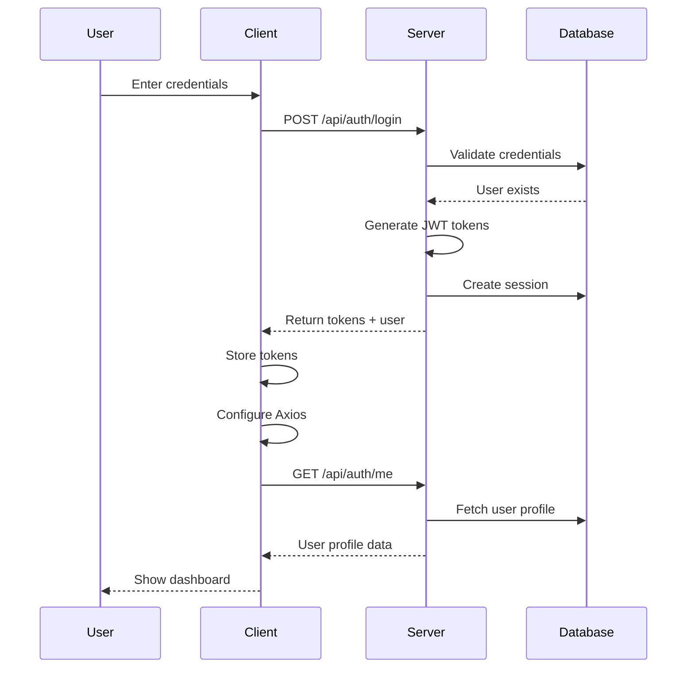

# Authentication System Documentation

## Overview

This document provides a comprehensive guide to the ILYTAT Designs authentication system. It covers the complete authentication flow from client to server, token management, session handling, and common troubleshooting steps.

## Architecture

The authentication system follows a token-based approach using JSON Web Tokens (JWT) with the following components:

1. **Client-Side Authentication Store** - Manages authentication state using Pinia
2. **Token Management** - Handles JWT access tokens and refresh tokens
3. **Session Management** - Tracks valid user sessions in the database
4. **Authentication Middleware** - Protects routes requiring authentication
5. **Role-Based Access Control** - Restricts access based on user roles/permissions

## Authentication Flow

### Login Process

1. User submits credentials to `/api/auth/login`
2. Server validates credentials and creates JWT tokens (access + refresh)
3. Server creates a session record in the database
4. Client stores tokens in the Pinia store and localStorage
5. Client configures Axios with the access token for future requests
6. Client fetches the user profile

### Token Validation

1. Client includes the token in the `Authorization` header
2. Server's `authenticateToken` middleware extracts and verifies the token
3. Server validates that the session is active in the database
4. Request proceeds if authentication is successful

### Session Management

Sessions are stored in the database and include:
- User ID
- Token
- IP address
- User agent
- Expiration time
- Validity flag

This allows for:
- Tracking active sessions
- Forced logout capabilities
- Security auditing

## Key Components

### Client Side

#### Auth Store (Pinia)

Located at: `app/client/src/stores/auth.js`

Key functions:
- `setTokens` - Stores tokens and configures Axios
- `clearTokens` - Removes tokens and clears Axios configuration
- `login` - Authenticates user credentials
- `logout` - Terminates the current session
- `fetchUserProfile` - Gets the current user's profile
- `refreshAccessToken` - Handles token refresh when expired
- `initialize` - Sets up authentication on app startup

#### Axios Configuration

Located at: `app/client/src/utils/axios.js`

- Configured to automatically include the Authorization header
- Includes interceptors to handle authentication errors

### Server Side

#### Auth Middleware

Located at: `app/server/src/middleware/auth.js`

Key functions:
- `authenticateToken` - Validates the JWT token
- `authorize` - Checks for required roles/permissions

#### Session Manager

Located at: `app/server/src/middleware/sessionManager.js`

Key functions:
- `createSession` - Records a new user session
- `validateSession` - Checks if a session is valid
- `invalidateSession` - Marks a session as invalid
- `invalidateAllUserSessions` - Logs out user from all devices

#### AuthController

Located at: `app/server/src/controllers/AuthController.js`

Key endpoints:
- `login` - Authenticates user
- `register` - Creates new user account
- `getCurrentUser` - Returns user profile
- `logout` - Terminates current session
- `logoutAllDevices` - Terminates all sessions

## Token Management

### Token Storage

Tokens are stored in:
1. Pinia store (memory) for active use
2. Local storage for persistence across page reloads

### Token Refresh Flow

1. When an API call returns a 401 error:
   - Client attempts to refresh the token
   - If successful, the original request is retried
   - If unsuccessful, user is logged out

## Common Issues and Troubleshooting

### 401 - No token provided

**Causes:**
- Client did not send the Authorization header
- Token not properly set after login
- Token cleared from storage

**Solutions:**
- Check that login sets the token correctly
- Verify that axios is configured with the token
- Ensure token is not being cleared accidentally

### 401 - Invalid or expired session

**Causes:**
- Session has been invalidated on the server
- User logged out from another device
- Admin forced logout

**Solutions:**
- Attempt token refresh
- If refresh fails, direct to login page

### 401 - Token expired

**Causes:**
- JWT token has passed its expiration time

**Solutions:**
- Attempt to use refresh token
- If refresh fails, redirect to login

## Security Best Practices

1. **HTTPS Only** - All authentication requests must use HTTPS
2. **Token Expiration** - Access tokens expire after a short period (24 hours)
3. **Secure Storage** - Tokens should never be stored in cookies without proper flags
4. **CSRF Protection** - Implemented for cookie-based authentication
5. **Rate Limiting** - Prevents brute force attacks

## Development Guidelines

1. Always use the authentication middleware for protected routes
2. Never bypass the session validation process
3. Include proper error handling for authentication failures
4. Log authentication events for audit purposes
5. Use the authorization middleware for role-based access control

## Testing Authentication

For local testing, use the provided test accounts:
- Regular user: `user@example.com` / `password123`
- Admin user: `admin@example.com` / `password123`

To test the authentication flow, see the test script at:
`_dev/shared/notes/auth_system_test.js`
